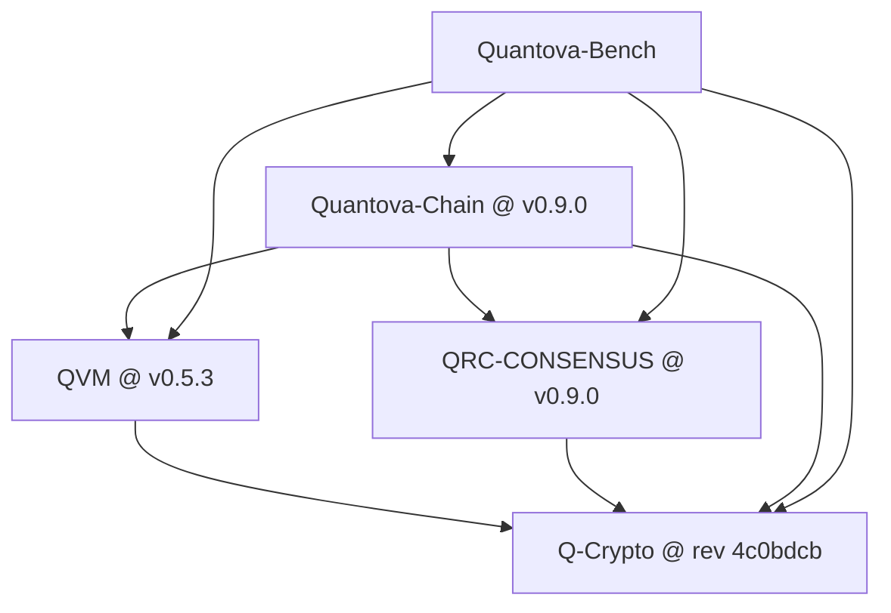

# Cross repo pin flow

The single tag each repo publishes for others to connect to, and the direction each pin points. A consumer pins the exact tag of everything below it, and the pin agreement gate proves the declared tag, the committed lockfile commit, and the remote peeled tag all agree. The signing edge Q-Crypto is anchored to an immutable commit rather than a tag, so it never drifts.

The current connecting tags.

- Q-Crypto is pinned by rev 4c0bdcb7dce9d2de6f9f510b0695377321076fef, the immutable signing edge, the same commit every consumer resolves.
- QVM v0.5.3, the secured VM.
- QRC-CONSENSUS v0.9.0, consensus with chain id bound attestations.
- Quantova-Chain v0.9.0, which pins QRC, QVM, and the crypto rev.
- Quantova-Bench, a leaf that pins the whole set to measure the real running flow.

Regenerate the PDF from this file so the diagram is always the one the pins actually resolve to, rather than a copy that drifts.
