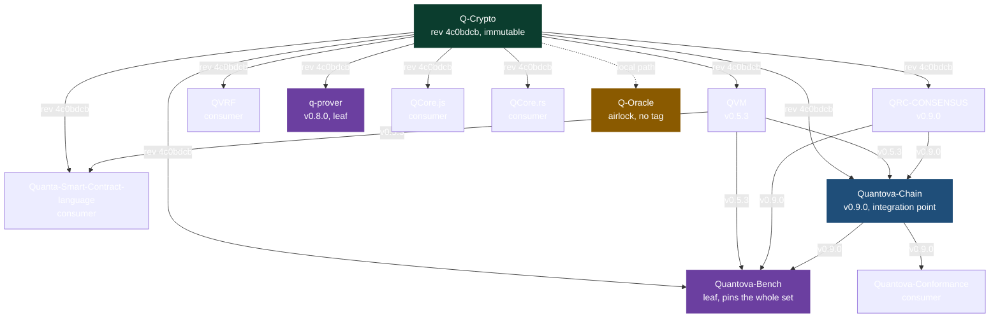

# Cross repo pin map

This is the complete cross repo pin map for the Quantova stack. It shows every repository that publishes a pin, the exact version each one publishes, and the direction every dependency points. Read it from the top. Q-Crypto sits at the root because it is the cryptography edge that everything signs and hashes against. The lines flow down through the virtual machine and the consensus layer, meet at Quantova-Chain which is the integration point, and end at Quantova-Bench which pins the whole set. Q-Oracle hangs off to the side as the airlock leaf that nothing else depends on.

Each line carries the exact version the consumer beneath it pins of the repository above it.

## What each pinned repository is and why others pin that exact version

Q-Crypto is the root of trust, the code that produces every signature and every hash in the stack. It is pinned by an immutable git commit, the revision 4c0bdcb7dce9d2de6f9f510b0695377321076fef, and never by a tag. A tag is a friendly name that a maintainer can later move to point at different code, while a commit revision can never change once it exists. Because every other repository has to resolve the exact same cryptography, the one edge that is never allowed to drift is nailed to a commit that cannot be moved.

QVM publishes v0.5.3, the secured virtual machine that runs contract code inside the chain. The contract language and the node both build against this exact version so that the bytecode the language emits and the bytecode the node executes are always the same machine.

QRC-CONSENSUS publishes v0.9.0, the QORUS committee consensus that decides which blocks become final. The node pins this exact version so that every validator agrees on the same voting and attestation rules, including the chain identifier that is folded into every attestation.

Quantova-Chain publishes v0.9.0, the node and the ledger, the piece that brings the cryptography, the virtual machine, and the consensus together into one running program. It is the integration point, so the benchmark suite and the conformance runner both pin this exact version and measure and test the real node rather than a loose collection of parts.

q-prover publishes v0.8.0, the hash based STARK prover. It is a leaf, which means it pins the cryptography root but nothing in the core stack pins it back, so it can move forward on its own cadence without forcing the rest of the stack to rebuild.

Q-Oracle has no published tag because it is the airlock, the component that reads and verifies foreign chains before their messages are allowed in. Nothing in the stack depends on Q-Oracle, so it does not need to publish a stable version for others to pin, and it reaches the cryptography root through a local path on disk rather than the shared commit while it is still being built.

## How the gate holds the map together

A consumer pins the exact tag of everything beneath it in the dependency stack, so the benchmark suite carries the versions of the chain, the consensus, the virtual machine, and the cryptography all at once. The pin agreement gate then proves that the declared tag in the manifest, the commit recorded in the committed lockfile, and the peeled tag on the remote all point at the same code, which is what stops any one of these pins from quietly drifting away from the others.
